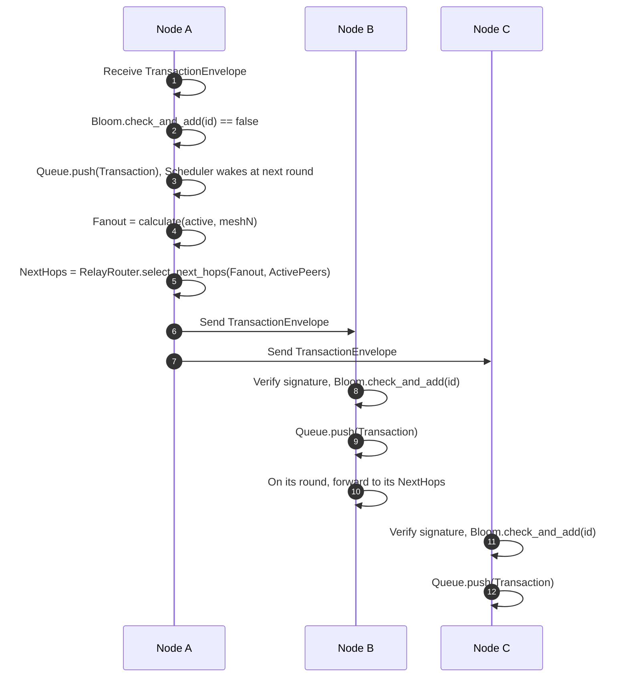
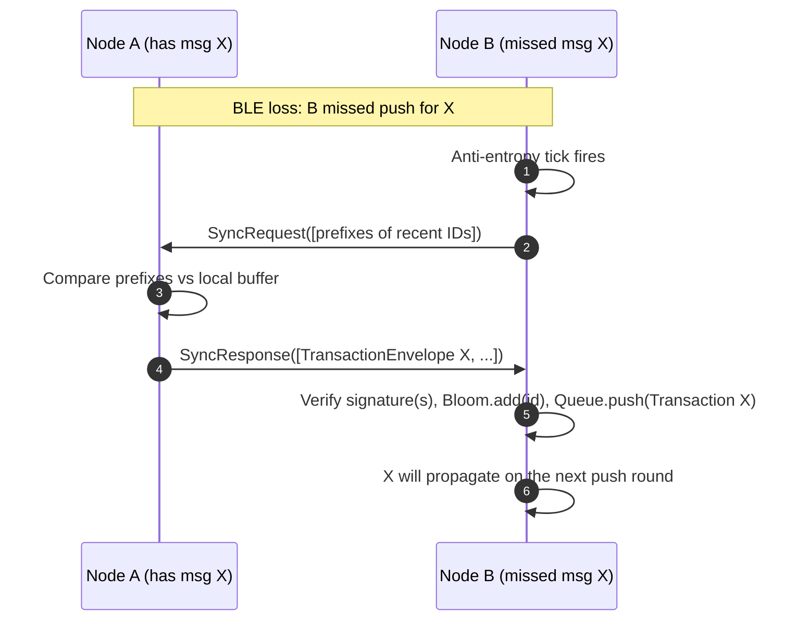

# Gossip Protocol Deep-Dive

StellarConduit uses an epidemic broadcast protocol tuned for low-bandwidth, lossy wireless links (primarily BLE). Rather than flooding every neighbor with every message, the protocol combines deduplication, round-based scheduling, dynamic fanout, and periodic anti-entropy to achieve high delivery probability with bounded overhead.

This document explains the push (epidemic) path and the pull-based anti-entropy mechanism, and maps each step to the relevant code paths in `src/gossip` (and related modules). It reflects the current implementation and clearly calls out areas with TODOs that are actively being wired up.

- Deduplication filter: `src/gossip/bloom.rs`
- Round scheduling: `src/gossip/round.rs`
- Dynamic fanout and random peer selection: `src/gossip/fanout.rs`
- Message prioritization: `src/gossip/queue.rs`
- Relay-aware peer ranking: `src/router/path_finder.rs`, `src/router/relay_router.rs`
- Anti-entropy types/timer: `src/message/types.rs`, `src/gossip/protocol.rs`

## Push-Based Gossip (Epidemic Broadcast)

When a node learns a new signed `TransactionEnvelope`, it propagates it to a subset of peers at scheduled intervals. The core loop is:

1) A node receives a new TransactionEnvelope.
   - The envelope is locally processed and queued as a `ProtocolMessage::Transaction` in the active priority buffer (`PriorityQueue`).

2) The Bloom filter is checked; duplicates are dropped.
   - The deduplicator uses a Bloom filter to suppress re-transmission of already-seen message IDs.
   - Implementation: `MessageFilter` and `SlidingBloomFilter` in `src/gossip/bloom.rs`. The sliding variant keeps two windows (current/previous) to bound memory while retaining recent history.
   - Semantics: `check_and_add([u8; 32]) -> bool` returns true if the ID is probably seen (false positives possible), or adds and returns false if definitely new. This provides strong duplicate suppression without expensive exact-set storage.

3) The GossipScheduler wakes up during the next round.
   - Implementation: `GossipScheduler` in `src/gossip/round.rs`.
   - Active rounds run every 500ms while messages are flowing; after 30s of inactivity the node becomes idle and rounds slow to 5s to save energy (`ACTIVE_ROUND_INTERVAL_MS=500`, `IDLE_ROUND_INTERVAL_MS=5000`, `IDLE_TIMEOUT_SEC=30`).
   - The main gossip loop in `src/gossip/protocol.rs` uses this scheduler to decide when to fire a round.

4) The FanoutCalculator decides how many peers to forward to.
   - Implementation: `FanoutCalculator` in `src/gossip/fanout.rs`.
   - Rules:
     - Clamp between `MIN_FANOUT=2` and `MAX_FANOUT=6`.
     - If the mesh size is known, target ≈ ceil(ln(N)) bounded by min/max.
     - If mesh size is unknown and active connections > max, use a conservative `FALLBACK_FANOUT=3`.
     - Never exceed the number of active connections.

5) The RelayRouter picks the best peers (closest to a relay).
   - Peers are ranked by `PathFinder::rank_next_hops` (`src/router/path_finder.rs`), which computes shortest paths toward known relay nodes using the local topology/hop-count view.
   - `RelayRouter::select_next_hops` (`src/router/relay_router.rs`) truncates the ranked list to the target fanout. When no path to a relay is known, pure random selection helpers in `fanout.rs` (`select_random_peers`) are available. The router currently relies on the pre-ranked ordering.

6) The transaction is sent.
   - The active queue (`PriorityQueue`) orders control messages (`SyncRequest`, `SyncResponse`, `TopologyUpdate`) ahead of transactions. Transactions are forwarded according to the chosen fanout set.
   - In the current code, the round/timer wiring and prioritization are implemented; the broadcast step is being finalized where marked with TODOs in `gossip/protocol.rs`. The design above reflects how the code paths compose as those TODOs land.

### Why Not Flood?

Unrestrained flooding overwhelms BLE links, increases collisions, and drains battery. Bounded fanout with deduplication provides probabilistic coverage with far less load. By biasing peers that are closer to a relay, the network converges more quickly to settlement while still achieving mesh-wide dissemination in the background.

## Pull-Based Anti-Entropy

BLE is lossy: advertisements can be missed, connections are short-lived, and apps can be backgrounded. Push alone cannot guarantee that every device eventually learns about every envelope. Anti-entropy periodically reconciles state between neighbors, repairing gaps without constant chatter.

- Timer: the main loop starts a periodic anti-entropy tick (every ~30s) in `gossip/protocol.rs`.
- Types: `SyncRequest` and `SyncResponse` live in `src/message/types.rs`.
  - `SyncRequest { known_message_ids: Vec<[u8; 4]> }` sends a compact sketch of recently held IDs using a 4-byte prefix of the 32-byte message ID.
  - `SyncResponse { missing_envelopes: Vec<TransactionEnvelope> }` returns full envelopes that the requester is missing.

Reconciliation flow:
1) Pick one active neighbor on the anti-entropy tick.
2) Build a `SyncRequest` from the local active buffer (e.g., hash-prefix sketch of recent IDs).
3) Neighbor compares prefixes against its active buffer and identifies candidates the requester likely lacks.
4) Neighbor replies with a `SyncResponse` carrying those full `TransactionEnvelope`s.
5) The requester verifies signatures, updates its Bloom filter, enqueues the envelopes, and they join the normal push rounds.

Note: The timer and message types are wired up in `gossip/protocol.rs` and `message/types.rs`. The send/receive handlers are being connected behind TODOs to complete the full request/response flow.

## Sequence Diagrams

### Normal Push Gossip (3 Nodes)

### Anti-Entropy Recovering a Dropped Message

## Implementation Notes and Pointers

- Scheduler timings and idle transition are defined in `gossip/round.rs` and have unit tests for active/idle behavior.
- Fanout calculation and random peer sampling live in `gossip/fanout.rs` with criterion benches to validate performance.
- Deduplication behavior is covered by tests in `gossip/bloom.rs`; the sliding window reduces false positives while bounding memory.
- The main event loop (`gossip/protocol.rs`) wires the round and anti-entropy timers and prioritizes control messages via `gossip/queue.rs`. The specific broadcast and sync handlers are being finalized where marked TODO.

## Contribution Guidelines

- Wait until Issues #7 (Bloom), #8 (Scheduler), #9 (Fanout), and #17 (Sync) are merged so this document matches the final implementation.
- Branch from `main` as `docs/gossip-architecture`.
- Commit message: `docs(architecture): write gossip protocol deep-dive`.
